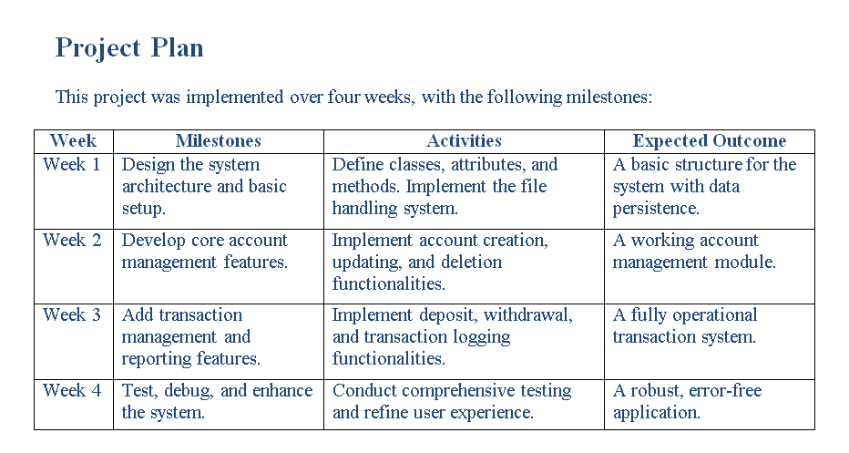

# Bank Management System

A console-based C++ application designed to manage bank accounts efficiently. The system includes core functionalities such as account creation, updating, deposits, withdrawals, and maintaining transaction records, with persistent data storage using file handling.

## Features

### 1. Account Management

- Create new accounts with the following details:
  - Account number
  - Account holder name
  - Initial balance
  - Account type (e.g., Savings, Current)
- Update existing account details, such as account holder name and balance.
- Delete accounts securely when needed.

### 2. Transaction Management

- Deposit funds into an account, updating the account balance accordingly.
- Withdraw funds from an account, ensuring sufficient balance is available.
- Maintain a transaction history log for future reference.

### 3. Data Persistence

- Save account details and transaction history in files (`accounts.txt` and `transactions.txt`) for permanent storage.
- Automatically load account details from the file when the application starts.
- Log all transactions (deposits and withdrawals) for auditing purposes.

### 4. User-Friendly Console Menu

- Interactive text-based menu for easy navigation.
- Real-time feedback for all operations (e.g., success, failure, or error messages).

---

## Usage

### Menu Options

1. **Create New Account**: Add a new account with a unique account number, holder name, account type, and initial balance.
2. **Update Existing Account**: Modify account details such as holder name or balance.
3. **Check Account Details**: Retrieve detailed information about a specific account.
4. **Deposit Amount**: Add funds to an account.
5. **Withdraw Amount**: Subtract funds from an account if the balance is sufficient.
6. **Search for an Account**: Verify if an account exists using the account number.
7. **Close an Account**: Permanently delete an account from the system.
8. **Exit**: Save all data and exit the program.

---

---
